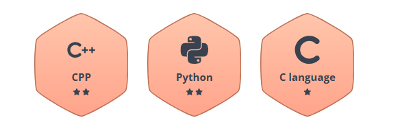

  

  
#### I am Ronit Raj, a second-year B.Tech CSE student at Arya College of Engineering, with a passion for Web development and Software Engineering. I have strong technical skills in Programming Languages such as c, c++, JS, web development. I aim to contribute to impactful projects and create solutions that make a difference.

<h3 align="center">A passionate frontend developer from India, "Coding my way through the tech universe."</h3>

<h3 align="center">A passionate frontend developer from India</h3>

  

 
 

  

# 💻 Tech Stack:

## 📊 GitHub Stats & Trophies

  
  

  

  

  

  

  

## 🛠️ Languages & Tools

  

## 🏅 HackerRank Badge

  

## 🔗 Connect with Me

     

<picture>
  <source media="(prefers-color-scheme: dark)" srcset="https://raw.githubusercontent.com/tobiasmeyhoefer/tobiasmeyhoefer/output/github-snake-dark.svg" />
  <source media="(prefers-color-scheme: light)" srcset="https://raw.githubusercontent.com/tobiasmeyhoefer/tobiasmeyhoefer/output/github-snake.svg" />
  
</picture>

  
    
    <b>@its_rsr04</b>
  
  
    
    <b>+91 7368868707</b>
  
  
    
    <b>ronitrajrsr0409@gmail.com</b>
  

  

---

  

 

